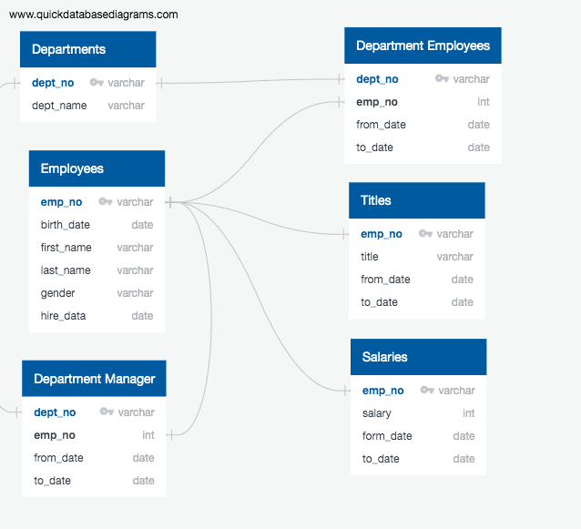
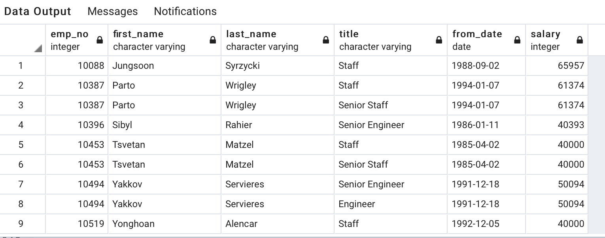
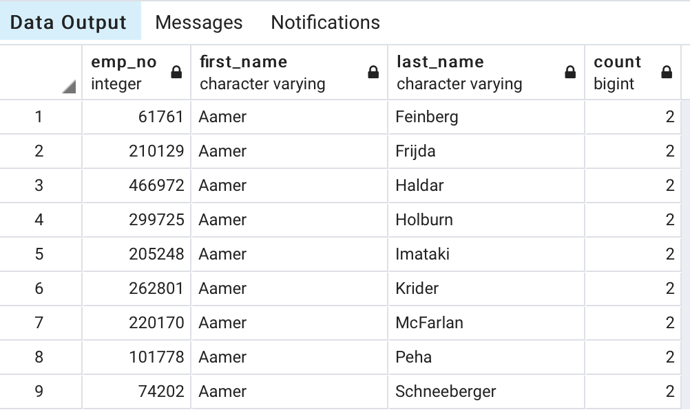
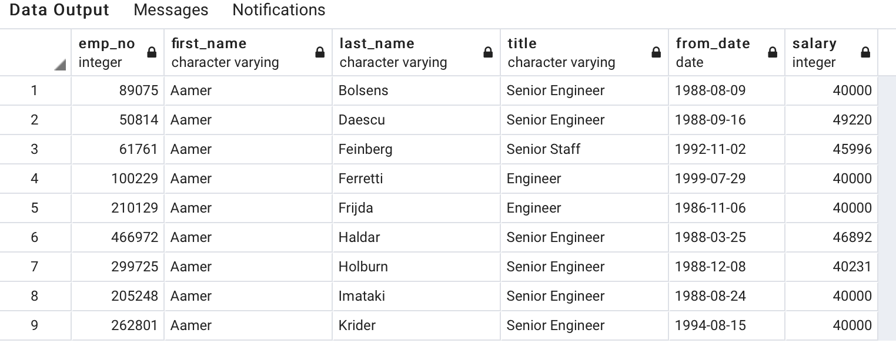
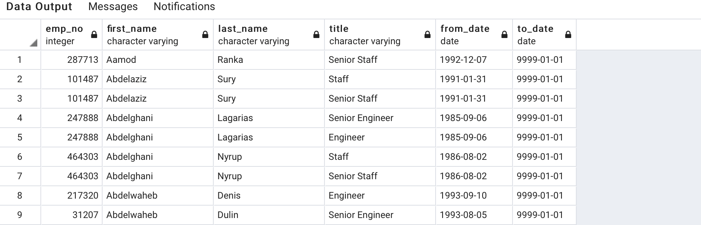

# Pewlett-Hackard-Analysis
Pewlett-Hackard-Analysis.
An HR analyst from Pewlett Hackard (PH), Bobby, needed my help to solve some complicated retirement issues by analyzing their employment data.

I used Quick Database Diagrams to map the schema and the relationships between the tables, including the primary and foreign keys. I wrote Postgres SQL Pgadmin commands to extract data from the 6 database provided and create new tables that fit the criteria.


I then wrote the pgadmin queries to import data from the csv files and create their respective tables. Please refer to this link for the queries used for this step. <link> https://github.com/priyankasenapati/Pewlett-Hackard-Analysis/blob/master/schema.sql

After creating the tables I wrote SQL queries to extract the data from one or more tables and saved them into new tables. I also exported the data from the newly created tables into their respective .csv files. Please refer to this link for the queries used for this step. <link> https://github.com/priyankasenapati/Pewlett-Hackard-Analysis/blob/master/Queries/queries.sql

The table listing the retiring employees who were born between 1952 and 1955, hired from 1985 to 1988 and their last date of employment was 9999-01-01 can be found here. <link> https://github.com/priyankasenapati/Pewlett-Hackard-Analysis/blob/master/Data/current_emp.csv

The table shows that there are 33118 employees eligible for retirement. 

Challenge
The challenge was to create a new list of mentors who are still employed along with their latest titles and are retiring in a certain period, and a list of new employees who needed to be mentored. The SQL queries I wrote to create new tables with this data can be found at the following location <link> https://github.com/priyankasenapati/Pewlett-Hackard-Analysis/blob/master/Priyanka_senapati_Pewlett-Hackard-Analysis-Module-Challenge.sql

* To create a list of current employees of each title that are presently eligible for retirement, INNER JOIN was used.
    * Table listing for eligible retirement can be found at the following location. <link> https://github.com/priyankasenapati/Pewlett-Hackard-Analysis/blob/master/retiring_titles.png
    * 
    * <insert diagram>
  
  

* To find employees that have duplicate titles from the eligible retirement table, GROUP BY was used.
    * The table with the duplicate records can be found at the following location <link>: https://github.com/priyankasenapati/Pewlett-Hackard-Analysis/blob/master/duplicate_emp_records.png
    * <insert diagram>


* The latest title was kept in ret_latest_titles by deleting the duplicate rows using PARTITION. These employees are eligible for becoming a mentor. <link> https://github.com/priyankasenapati/Pewlett-Hackard-Analysis/blob/master/ret_latest_titles.png
* <insert diagram>


* For extracting the employees who are in the need for a mentor, inner join was used to find list of current employees that are born after 1965. These employees represent the new workforce at PH who are in need of a mentor.
    * Mentor Table <link>: https://github.com/priyankasenapati/Pewlett-Hackard-Analysis/blob/master/mentors.png
    *  
    * <insert diagram> 
  


Recommendation for further analysis on the data set:
These are my suggested analysis on the employment database to better understand the problem of retirement at PH:
* Promote high performance employees from the previous title and train them to fill in for employees retiring at a higher title. This will help maintain a growth culture at PH which will drive up employee satisfaction and motivation.

